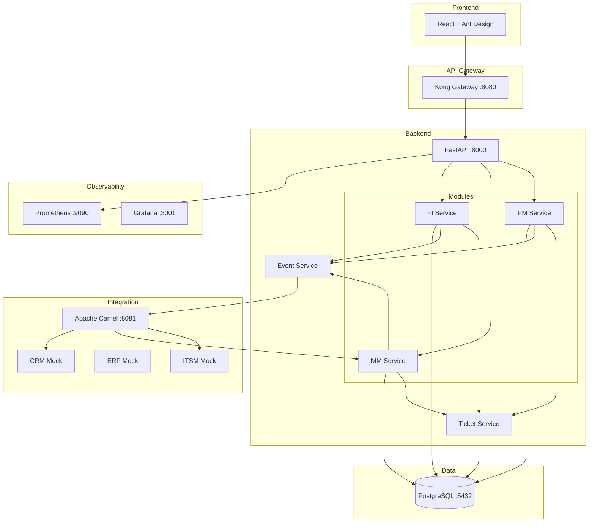
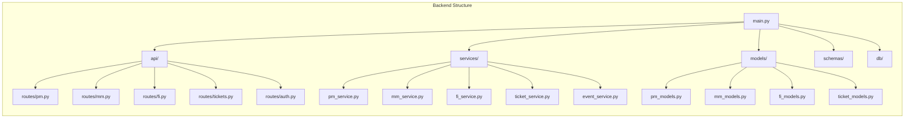
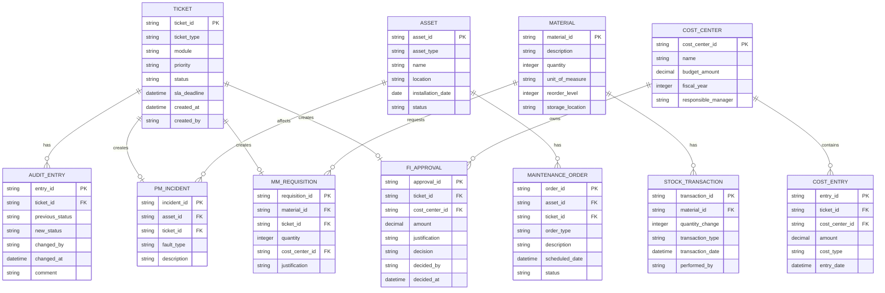

# Design Document: SAP ERP Demo System

## Overview

This design document describes a demo-grade SAP-like ERP application with three core modules (Plant Maintenance, Materials Management, and Finance) that share a unified ticketing system and integrate with a MuleSoft Anypoint Platform clone. The system follows a modular microservices-inspired architecture while running as a monolithic FastAPI application for simplicity.

The architecture emphasizes:
- **Module Isolation**: Each SAP module (PM, MM, FI) has its own database schema and service layer
- **Unified Ticketing**: A shared ticketing service provides consistent ticket management across modules
- **Event-Driven Integration**: Modules emit events consumed by Apache Camel for downstream routing
- **Enterprise UX**: React frontend with Ant Design implementing SAP Fiori patterns

## Architecture

### High-Level Architecture



### Component Architecture



## Components and Interfaces

### Backend Components

#### 1. FastAPI Application (main.py)
- Entry point for the backend application
- Configures CORS, middleware, and route registration
- Initializes database connections and event handlers

#### 2. API Routes

| Route Module | Base Path | Description |
|-------------|-----------|-------------|
| pm.py | /api/v1/pm | Plant Maintenance endpoints |
| mm.py | /api/v1/mm | Materials Management endpoints |
| fi.py | /api/v1/fi | Finance endpoints |
| tickets.py | /api/v1/tickets | Unified ticket operations |
| auth.py | /api/v1/auth | Authentication endpoints |

#### 3. Service Layer

| Service | Responsibility |
|---------|---------------|
| PMService | Asset CRUD, maintenance orders, incident management |
| MMService | Inventory management, stock monitoring, purchase requisitions |
| FIService | Cost center management, cost tracking, approvals |
| TicketService | Unified ticket creation, status transitions, SLA management |
| EventService | Event publishing to Apache Camel webhooks |

#### 4. Database Layer
- SQLAlchemy ORM with async support
- Connection pooling via asyncpg
- Schema-per-module isolation

### API Contracts

#### PM Module Endpoints

```yaml
POST /api/v1/pm/assets:
  request:
    asset_type: string (substation|transformer|feeder)
    name: string
    location: string
    installation_date: date
  response:
    asset_id: string
    status: string

POST /api/v1/pm/maintenance-orders:
  request:
    asset_id: string
    order_type: string (preventive|corrective|emergency)
    description: string
    scheduled_date: datetime
  response:
    order_id: string
    ticket_id: string

POST /api/v1/pm/incidents:
  request:
    asset_id: string
    fault_type: string (fault|outage|degradation)
    severity: string (P1|P2|P3|P4)
    description: string
  response:
    incident_id: string
    ticket_id: string
```

#### MM Module Endpoints

```yaml
POST /api/v1/mm/materials:
  request:
    material_id: string
    description: string
    quantity: integer
    unit_of_measure: string
    reorder_level: integer
    storage_location: string
  response:
    material_id: string

POST /api/v1/mm/stock-transactions:
  request:
    material_id: string
    quantity_change: integer
    transaction_type: string (receipt|issue|adjustment)
  response:
    transaction_id: string
    new_quantity: integer

POST /api/v1/mm/purchase-requisitions:
  request:
    material_id: string
    quantity: integer
    cost_center_id: string
    justification: string
  response:
    requisition_id: string
    ticket_id: string
```

#### FI Module Endpoints

```yaml
POST /api/v1/fi/cost-centers:
  request:
    cost_center_id: string
    name: string
    budget_amount: decimal
    fiscal_year: integer
    responsible_manager: string
  response:
    cost_center_id: string

POST /api/v1/fi/cost-entries:
  request:
    ticket_id: string
    amount: decimal
    cost_type: string (CAPEX|OPEX)
    cost_center_id: string
  response:
    entry_id: string

POST /api/v1/fi/approval-requests:
  request:
    amount: decimal
    justification: string
    cost_center_id: string
    approval_hierarchy: array[string]
  response:
    approval_id: string
    ticket_id: string
```

#### Ticket Endpoints

```yaml
GET /api/v1/tickets:
  query_params:
    module: string (PM|MM|FI)
    status: string
    priority: string
    page: integer
    limit: integer
  response:
    tickets: array[Ticket]
    total: integer

PATCH /api/v1/tickets/{ticket_id}/status:
  request:
    new_status: string (Open|Assigned|In_Progress|Closed)
    comment: string
  response:
    ticket_id: string
    status: string
    audit_entry: AuditEntry
```

### Event Schemas

#### PM Ticket Event
```json
{
  "event_id": "evt-uuid",
  "event_type": "PM_TICKET_CREATED|PM_TICKET_UPDATED",
  "correlation_id": "corr-uuid",
  "timestamp": "2024-01-15T10:30:00Z",
  "payload": {
    "ticket_id": "TKT-PM-20240115-0001",
    "ticket_type": "Incident",
    "asset_id": "AST-001",
    "fault_type": "outage",
    "severity": "P1",
    "status": "Open"
  }
}
```

#### MM Stock Event
```json
{
  "event_id": "evt-uuid",
  "event_type": "MM_STOCK_CHANGED|MM_REORDER_TRIGGERED",
  "correlation_id": "corr-uuid",
  "timestamp": "2024-01-15T10:30:00Z",
  "payload": {
    "material_id": "MAT-001",
    "quantity_change": -10,
    "new_quantity": 5,
    "reorder_level": 10,
    "transaction_type": "issue"
  }
}
```

#### FI Approval Event
```json
{
  "event_id": "evt-uuid",
  "event_type": "FI_APPROVAL_REQUESTED|FI_APPROVAL_COMPLETED",
  "correlation_id": "corr-uuid",
  "timestamp": "2024-01-15T10:30:00Z",
  "payload": {
    "ticket_id": "TKT-FI-20240115-0001",
    "approval_id": "APR-001",
    "amount": 50000.00,
    "cost_type": "CAPEX",
    "decision": "approved|rejected"
  }
}
```

### Integration Layer

#### Kong Gateway Configuration
```yaml
services:
  - name: sap-erp-backend
    url: http://backend:8000
    routes:
      - name: api-route
        paths:
          - /api/v1
        strip_path: false
    plugins:
      - name: jwt
      - name: rate-limiting
        config:
          minute: 100
      - name: prometheus
```

#### Apache Camel Routes
```java
// PM Ticket → ITSM
from("webhook:pm-events")
  .filter(header("event_type").startsWith("PM_"))
  .to("http://itsm-mock:8082/tickets");

// MM Stock → ERP
from("webhook:mm-events")
  .filter(header("event_type").startsWith("MM_"))
  .to("http://erp-mock:8083/inventory");

// FI Approval → CRM
from("webhook:fi-events")
  .filter(header("event_type").startsWith("FI_"))
  .to("http://crm-mock:8084/approvals");
```

## Data Models

### Entity Relationship Diagram



### Database Schema Design

Each module uses a separate PostgreSQL schema:

```sql
-- Schema: pm
CREATE SCHEMA pm;

-- Schema: mm  
CREATE SCHEMA mm;

-- Schema: fi
CREATE SCHEMA fi;

-- Schema: core (shared)
CREATE SCHEMA core;
```


## Correctness Properties

*A property is a characteristic or behavior that should hold true across all valid executions of a system-essentially, a formal statement about what the system should do. Properties serve as the bridge between human-readable specifications and machine-verifiable correctness guarantees.*

Based on the prework analysis, the following correctness properties have been identified for property-based testing:

### Property 1: Ticket Creation Validity

*For any* ticket creation request in any module (PM, MM, FI), the generated ticket SHALL have:
- A unique Ticket_ID matching the format `TKT-{MODULE}-{YYYYMMDD}-{SEQUENCE}`
- A valid ticket_type from the set {Incident, Maintenance, Procurement, Finance_Approval}
- An SLA deadline calculated correctly based on priority (P1: +4h, P2: +8h, P3: +24h, P4: +72h)

**Validates: Requirements 1.1, 1.2, 1.3**

### Property 2: Ticket State Machine Enforcement

*For any* ticket and any attempted status transition, the system SHALL:
- Accept transitions following the valid path: Open → Assigned → In_Progress → Closed
- Reject any transition that violates this sequence (e.g., Open → Closed, In_Progress → Assigned)
- Create an audit entry for every successful transition

**Validates: Requirements 1.4, 1.5**

### Property 3: Asset Data Round-Trip

*For any* valid asset creation request with asset_type, name, location, installation_date, and status, creating then retrieving the asset SHALL return an equivalent object with all fields preserved.

**Validates: Requirements 2.1**

### Property 4: Maintenance Order Asset Linkage

*For any* maintenance order creation, the order SHALL:
- Reference an existing, valid asset_id
- Have a valid order_type from {preventive, corrective, emergency}
- Generate a corresponding ticket with type Maintenance

**Validates: Requirements 2.2, 2.3**

### Property 5: Material Data Round-Trip

*For any* valid material creation request with material_id, description, quantity, unit_of_measure, reorder_level, and storage_location, creating then retrieving the material SHALL return an equivalent object with all fields preserved.

**Validates: Requirements 3.1**

### Property 6: Auto-Reorder Ticket Generation

*For any* stock transaction that reduces quantity below reorder_level, the system SHALL automatically generate a Procurement ticket with:
- Ticket type = Procurement
- Reference to the affected material_id
- Suggested reorder quantity = reorder_level - current_quantity + buffer

**Validates: Requirements 3.2**

### Property 7: Stock Transaction History Completeness

*For any* sequence of stock transactions on a material, the transaction history SHALL:
- Contain all transactions in chronological order
- Have each transaction with timestamp, quantity_change, transaction_type, and performed_by
- Sum of all quantity_changes equals current_quantity minus initial_quantity

**Validates: Requirements 3.5**

### Property 8: Cost Center Data Round-Trip

*For any* valid cost center creation request with cost_center_id, name, budget_amount, fiscal_year, and responsible_manager, creating then retrieving the cost center SHALL return an equivalent object with all fields preserved.

**Validates: Requirements 4.1**

### Property 9: Cost Entry Tracking

*For any* cost entry creation, the entry SHALL:
- Reference a valid ticket_id
- Reference a valid cost_center_id
- Have a valid cost_type from {CAPEX, OPEX}
- Have a positive amount

**Validates: Requirements 4.2**

### Property 10: Event Emission with Correlation

*For any* operation that triggers an event (ticket creation/update, stock change, approval decision), the emitted event SHALL:
- Have a unique event_id
- Have a correlation_id matching the originating request
- Have a valid event_type prefix matching the source module (PM_, MM_, FI_)
- Have a timestamp within acceptable tolerance of the operation time

**Validates: Requirements 2.4, 3.4, 4.5, 5.2, 6.3**

### Property 11: JWT Token Structure

*For any* successful authentication, the issued JWT token SHALL contain:
- A valid user_id claim
- A roles claim with at least one valid role
- An exp claim set to a future timestamp
- Decoding and re-encoding the token payload produces equivalent claims

**Validates: Requirements 7.1**

### Property 12: Role-Based Access Control

*For any* user with a specific role and any API endpoint, access SHALL be:
- Granted if the role is authorized for that endpoint's module
- Denied with 403 status if the role is not authorized
- Denied with 401 status if no valid token is provided

Role-to-module mapping:
- Maintenance_Engineer → PM_Module
- Store_Manager → MM_Module
- Finance_Officer → FI_Module
- Admin → All modules

**Validates: Requirements 7.2, 7.3, 7.4, 7.5, 7.6**

### Property 13: Structured Log Format

*For any* API request processed by the system, the generated log entry SHALL:
- Be valid JSON
- Contain correlation_id, timestamp, service, and log_level fields
- Have log_level from {DEBUG, INFO, WARNING, ERROR}

**Validates: Requirements 6.2**

## Error Handling

### Error Response Format

All API errors follow a consistent structure:

```json
{
  "error": {
    "code": "ERR_CODE",
    "message": "Human-readable message",
    "details": {},
    "correlation_id": "uuid"
  }
}
```

### Error Codes by Category

| Category | Code | HTTP Status | Description |
|----------|------|-------------|-------------|
| Validation | VAL_001 | 400 | Invalid request payload |
| Validation | VAL_002 | 400 | Missing required field |
| Validation | VAL_003 | 400 | Invalid field format |
| Auth | AUTH_001 | 401 | Missing authentication |
| Auth | AUTH_002 | 401 | Invalid token |
| Auth | AUTH_003 | 403 | Insufficient permissions |
| Resource | RES_001 | 404 | Resource not found |
| Resource | RES_002 | 409 | Resource conflict |
| Business | BUS_001 | 422 | Invalid state transition |
| Business | BUS_002 | 422 | Business rule violation |
| System | SYS_001 | 500 | Internal server error |
| System | SYS_002 | 503 | Service unavailable |

### Error Handling Strategy

1. **Validation Errors**: Caught at API layer, return 400 with field-level details
2. **Authentication Errors**: Caught by middleware, return 401/403
3. **Business Logic Errors**: Caught in service layer, return 422 with context
4. **Database Errors**: Caught and wrapped, return 500 with correlation_id for debugging
5. **External Service Errors**: Retry with exponential backoff, circuit breaker pattern

## Testing Strategy

### Dual Testing Approach

This project employs both unit testing and property-based testing for comprehensive coverage:

#### Unit Tests
- Verify specific examples and edge cases
- Test integration points between components
- Validate error handling paths
- Framework: **pytest** with **pytest-asyncio**

#### Property-Based Tests
- Verify universal properties across all valid inputs
- Test invariants and round-trip behaviors
- Framework: **Hypothesis** for Python
- Configuration: Minimum 100 iterations per property test
- Each property test MUST be tagged with: `**Feature: sap-erp-demo, Property {number}: {property_text}**`

### Test Organization

```
tests/
├── unit/
│   ├── test_pm_service.py
│   ├── test_mm_service.py
│   ├── test_fi_service.py
│   ├── test_ticket_service.py
│   └── test_event_service.py
├── property/
│   ├── test_ticket_properties.py      # Properties 1, 2
│   ├── test_pm_properties.py          # Properties 3, 4
│   ├── test_mm_properties.py          # Properties 5, 6, 7
│   ├── test_fi_properties.py          # Properties 8, 9
│   ├── test_integration_properties.py # Property 10
│   ├── test_auth_properties.py        # Properties 11, 12
│   └── test_observability_properties.py # Property 13
├── integration/
│   └── test_api_endpoints.py
└── conftest.py
```

### Property Test Example

```python
from hypothesis import given, strategies as st, settings

@settings(max_examples=100)
@given(
    module=st.sampled_from(['PM', 'MM', 'FI']),
    priority=st.sampled_from(['P1', 'P2', 'P3', 'P4'])
)
def test_ticket_creation_validity(module, priority):
    """
    **Feature: sap-erp-demo, Property 1: Ticket Creation Validity**
    **Validates: Requirements 1.1, 1.2, 1.3**
    """
    # Test implementation
    pass
```

### Coverage Requirements

- Unit test coverage: Minimum 80%
- All 13 correctness properties must have corresponding property tests
- Integration tests for all API endpoints
- End-to-end tests for critical workflows (ticket lifecycle, stock reorder, approval flow)
